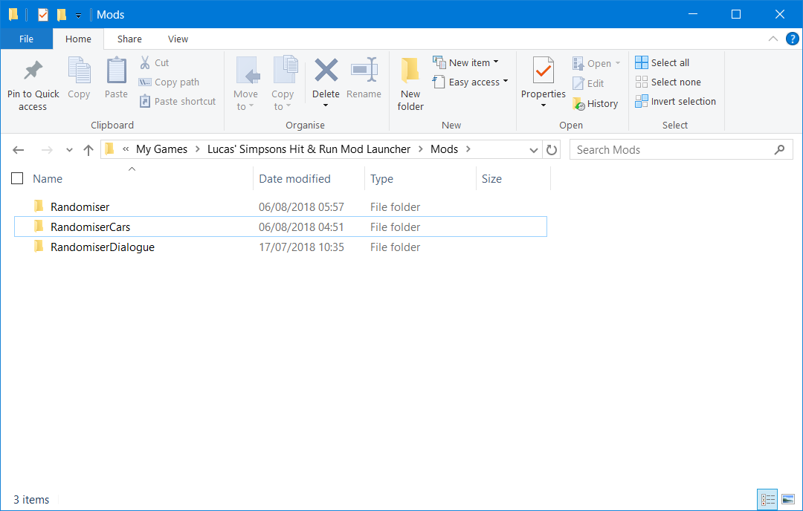
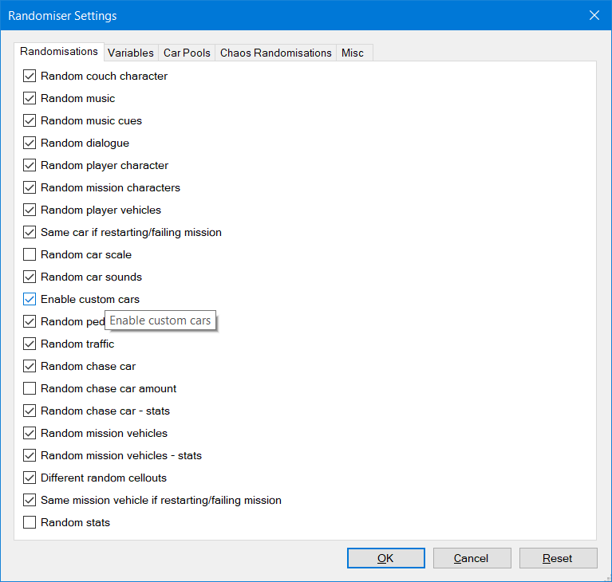
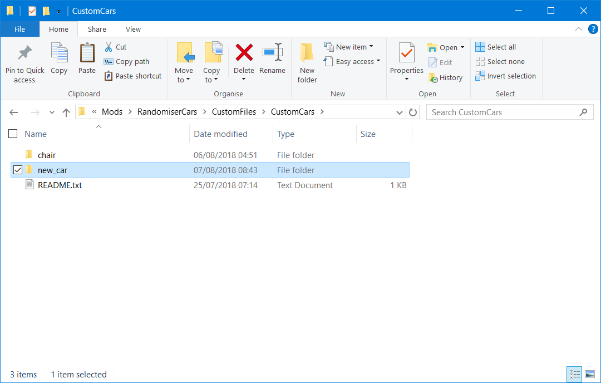

# How to use Custom Cars in the Randomiser

It is possible to add custom made cars to the Randomiser car pools by the use of the special Custom Car framework, and specially prepared car folder. Setting up the custom car pools itself is relatively simple, although creating a new custom car folder is more involved.

The custom car framework includes a sample custom "car" (a chair), which can be used to check the framework loads, and for reference if creating new custom cars.

**Warning:** There is a limit on the number of cars with custom sounds that can be loaded, if the game crashes you may have to remove the number of custom cars installed.

## Installing the Framework
### Step 1
Download the RandomiserCars.zip from the github release, and save it to any location.
### Step 2
Extract the RandomiserCars.zip to the same Mods folder you placed the Randomiser.lmlm file.  

### Step 3
Ensure the setting 'Enable Custom Cars' is ticked in the Randomiser's mod settings

## Installing additional cars
### Step 1
Download the custom car from the creator.
### Step 2
Extract the contents to Mods\RandomiserCars\CustomFiles\CustomCars (which should contain the folder 'chair' and other cars you have created)

## Creating additional cars
*Note:* This section is designed for modders with some familiarity with the game files, and as such may be more technical.
### Step 1
In the `Mods\RandomiserCars\CustomFiles\CustomCars` folder create a new subfolder with the car's name
### Step 2
Inside this folder you must include the following three files *at a minimum*:
- \<carname\>.p3d - <carname> must match the name of the folder
- \<carname\>.con
- car_tune.spt - The file must be named lowercase, and must only contain the car_tune.spt section for the car in question, with no blank lines at the end. (Consider checking `chair` for reference)
  
You may also add the following optional files:
- carsounds.spt - The file must be named lowercase, and can contain any number of sound files (Consider checking `chair` for reference)
- sound/carsound/X.rsd - Each referenced file in carsounds.spt must be included in these folders inside the car folder, and references as `sound/carsound/X.rsd` within carsounds.spt (Consider checking `chair` for reference)
### Step 3
Enable the 'Console' in the Developer tab of the Mod Launcher to test, any errors with the custom car will be reported.
### Step 4
If you want to distribute one or more cars, it is recommended you add the subfolder(s) inside a single .zip which can be extracted directly into CustomCars as per the steps above.

Any conflicts with car names or car sounds will not load the car, and the error will be printed to console.

For help, particularly creating custom cars, feel free to ask in [Our Discord](https://discordapp.com/invite/UQcTZgG).