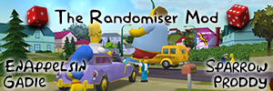

# Simpsons Hit & Run Randomiser

This mod allows for randomising vehicles, characters and more throughout the game.  
Each randomisation has its own option, detailed below.  

## Installation
Copy the mod file (.lmlm) to your Mods folder (usually Documents\My Games\Lucas' Simpsons Hit & Run Mod Launcher\Mods).  
Run the Mod Launcher and change the settings to match your needs, then play the game.  
All possible randomisations are available in separate settings.

## Discord
Questions about the mod or development can be asked on our [Discord Server](https://discord.gg/UQcTZgG).

## Settings
### Randomisations
#### Random couch character
On by default.  
If this is checked, you will get a random character sitting on the couch in the main menu.
#### Random music
On by default.  
If this is checked, the music played will be randomised to any track in the game.  
*If enabled with random music cues, both cues and music will be randomised*
#### Random music cues
Off by default.  
If this is checked, the cues that trigger different music tracks are randomised.  
*If enabled with random music, both cues and music will be randomised*
#### Random dialogue
Off by default.  
If this is checked, all in game dialogue will be randomised.  
*This requires a small one-off bit of extra work, detailed in [this documentation](RandomDialogue.md)*
#### Random player character
Off by default.  
If this is checked, you will get a random player character every time you load a level, from any character model in the game.
#### Random player character
Off by default.  
If this is checked, mission specific characters will be randomised every time you load a mission.  
Note: This excludes ambient characters (such as Apu in the Kwik-E Mart). These are randomised through Random pedestrians.
#### Random player vehicles
On by default.  
If this is checked, you will get a random vehicle per level/mission.
#### Same car if restarting/failing mission
On by default.  
If this is checked and you restart the mission (or retry after failing) you will get the same car again.  
You can change the car by cancelling the mission first and starting it again.  
If this is disabled you'll get a random car each time you restart.
#### Random car scale
Off by default.  
If this is checked, the model scale for any character in a car will be randomised.
#### Random car sounds
Off by default.  
If this is checked, car sounds (horns, engine, etc) will be randomised.  
If the car has an overlay (phone ringing, ice cream, etc) these are randomised too.
#### Enable custom cars
Off by default.
If this is checked, include additional custom cars in the randomiser.
*Adding additional cars requires extra work, detailed in [this documentation](CustomCars.md)*
#### Random pedestrians
On by default.  
If this is checked, pedestrians, drivers and ambient characters will be randomised per level load.  
You will get the same pedestrians for each mission of a level.
#### Random traffic
On by default.  
If this is checked, traffic cars will be randomised per level load.  
You will get the same traffic cars for each mission of a level.
#### Random chase car
On by default.  
If this is checked, chase cars will be randomised per level load.  
You will get the same chase cars for each mission of a level.
#### Random chase car amount
On by default.  
If this is checked, the number of chase cars will be randomised per level load.  
You will get the same number for each mission of a level.
#### Random chase car - stats
On by default.  
If this is checked, random chase cars will have the stats of the chosen car.  
Otherwise, random chase cars will have the stats of the level's default chase cars.
#### Random mission vehicles
On by default.  
If this is checked, most mission vehicles will be randomised (including races).  
You will get the same traffic cars for each mission of a level.
#### Random mission vehicles - stats
On by default.  
If this is checked, random mission vehicles will have the stats of the chosen vehicle.  
Otherwise, random mission vehicles will have the stats of the level's default vehicles.
#### Different random cellouts
On by default.  
If this is checked, cellouts will be 4 random cars instead of the same car 4 times.
#### Same mission vehicle if restarting/failing mission
On by default.  
If this is checked and you restart the mission (or retry after failing) you will get the same mission vehicles again.  
You can change the vehicles by cancelling the mission first and starting it again.  
If this is disabled you'll get random mission vehicles each time you restart.
#### Random stats
On by default.  
If this is checked, all randomised vehicles will have random stats. To customise, use the Random Stat Variables page.
### Random Stat Variables
#### Vehicle Mass
The mass of the vehicle can effect how it interacts with the ground, the lower the mass value of the vehicle is; the less friction will act upon it making the world an ice rink.  
Notice: It is believed that mass affects the toughness of a vehicle.
#### Gas Scale
The Gas scale is the acceleration of the vehicle if you were to just hold the acceleration button.
#### Slip Gas Scale
The Slip Gas Scale is the acceleration of a vehicle while it is sliding from speed or through the e-break.
#### Break Gas Scale
The Break Gas Scale is the breaking speed of a vehicle when it is not sliding or e-breaking.
#### Vehicle Speed
Provides a value for the top speed of the vehicle.
#### Wheel Turn Angle
The turn angle of the wheel effects how the vehicle steers, too high of a value being used can cause uncontrollability with a vehicle.
#### Wheel Grip
The wheel grip controls how the car will drift when it is driving - primarily on acceleration and steering - the higher the grip the more likely the car is to drift.
#### Steering
This controls the steering of the vehicle.
#### Slip Steering
This controls the steering of the vehicle while in a drift.
#### HP
This controls the amount of health that a vehicle has - The Armoured truck in 5-6 has 15 HP.
### Car Pools
#### Random Car Pool - Player
This controls which vehicles are in the random pool for the player's random vehicles.
#### Random Car Pool - Mission
This controls which vehicles are in the random pool for the mission random vehicles.
#### Random Car Pool - Traffic
This controls which vehicles are in the random pool for the traffic random vehicles.
#### Random Car Pool - Chase
This controls which vehicles are in the random pool for the chase car random vehicles.
### Misc
#### Remove car/costume requirements
Off by default.  
If this is checked, you won't need to be wearing a specific costume/be driving a specific car to start a mission.  
Removes the need for a coin route.
#### Skip cutscenes (except intro cutscene)
Off by default.  
If this is checked, all cutscenes bar the introduction cutscene won't be played.
#### Increase HP for weak cars
Off by default.  
If this is checked weak cars like the rocket car will have their HP slightly boosted so they're not quite as fragile.  
It raises the minimum HP to 0.8 for all cars.
#### Debug level
0 by default.  
This controls the verbosity of the console output. 0 will print basic information whereas 5 will print pretty much everything.  
	
## Potential Limitations/Issues
- Missions will spawn you where you start if you restart the mission once, this is because adding a forced car teleports you.

- The list of cars to chose from is built into the script and so if you use mods which add extra cars they won't be chosen,
and if a mod removes cars the game will crash if the randomiser picks it.

- Your car will vanish at the end of the mission, even if you are in it. Again this is because of how forced cars work.

- There is a spot where random characters will be sat in mid air. This is due to how passengers/drivers work.

## Acknowledgements
Mod authors are EnAppelsin, Proddy, Sparrow and Gadie

Thanks to the following people for helping with the development and testing of this mod:

Gibstack, Kuinn, Jake, LiquidWiFi, Loren, Nytheris, Pepperdork
