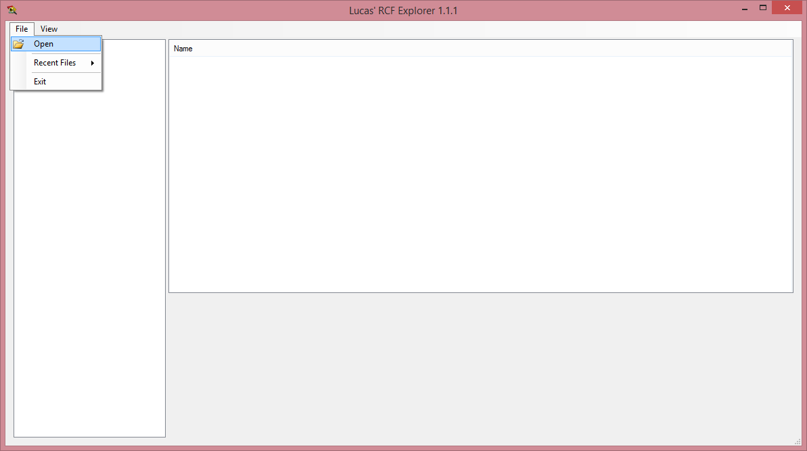
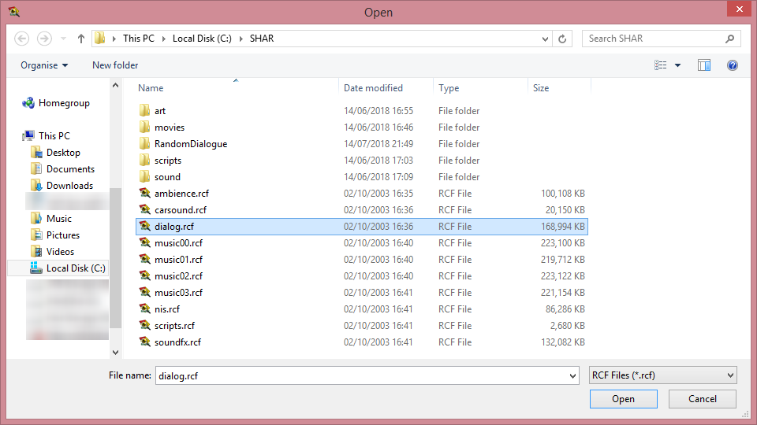
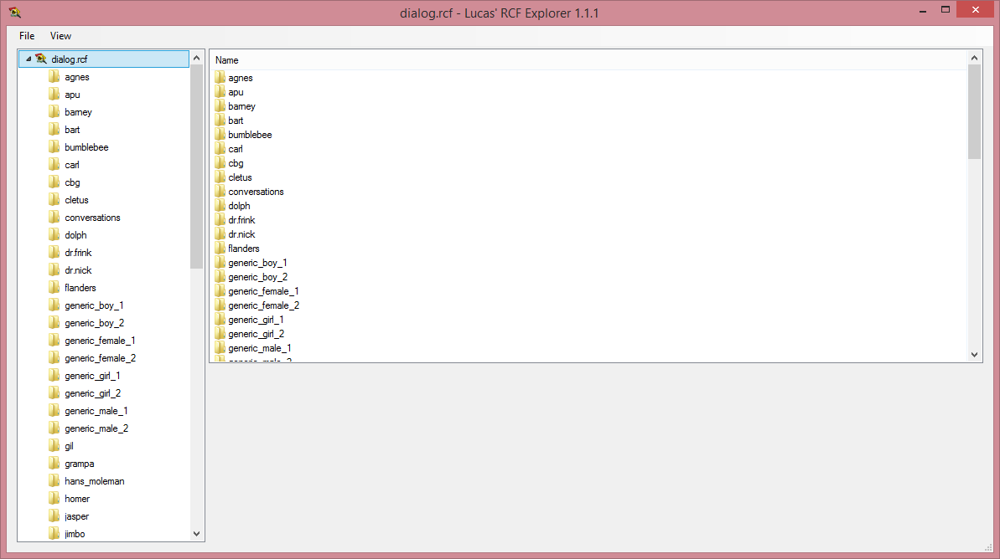
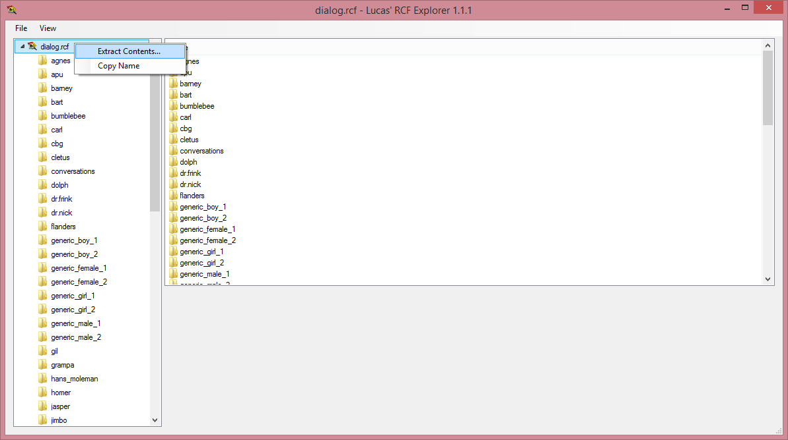
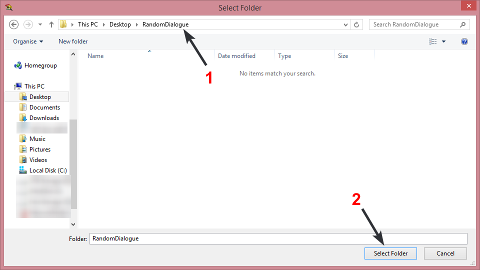
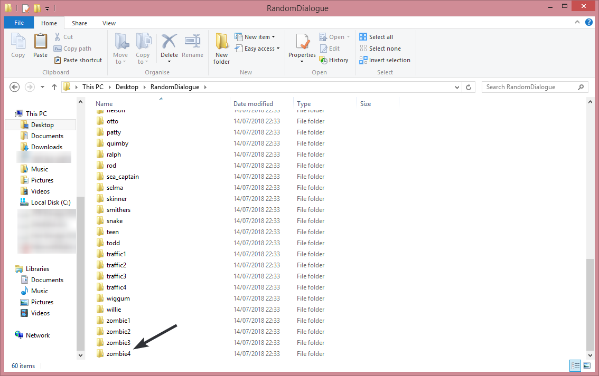
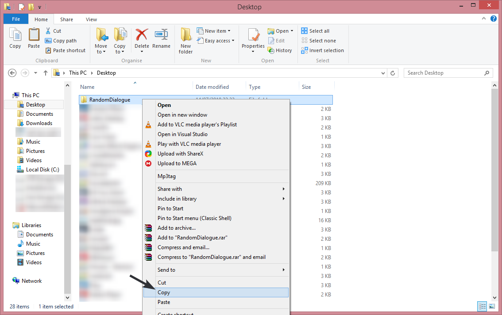
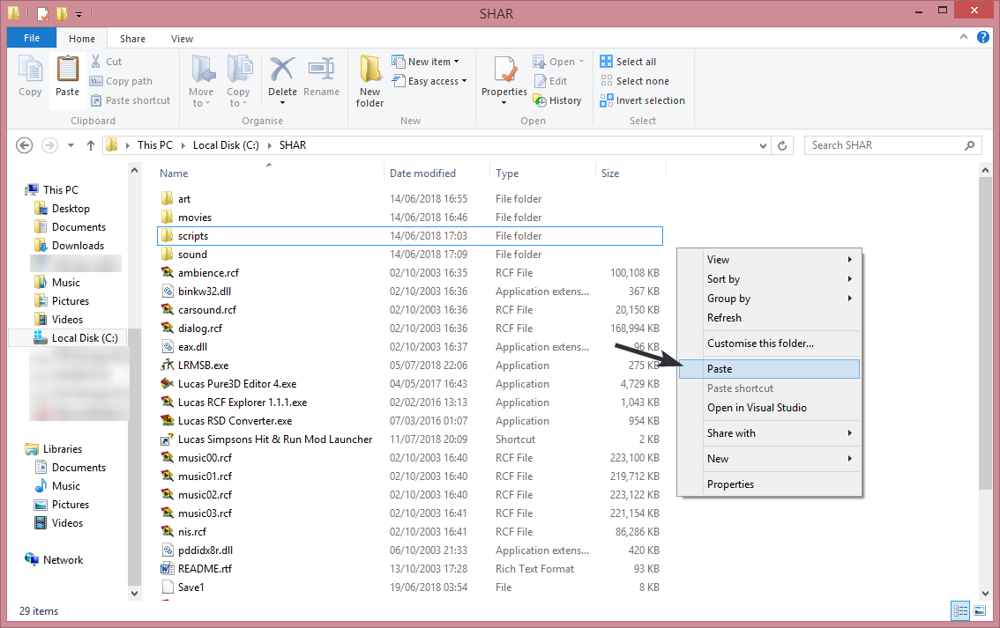

# How to setup Random Dialogue

Due to current limitations in the game and mod launcher, we can not redirect directly to other files inside an RCF archive.  
This means we are required to load the RSD files from a separate source. This was the cause of the 50MB file size of a previous version, where we added every conversation dialogue RSD in order for the old character randomisation method.  
To do a full randomised dialogue in this way, it'd increase the mod size by about 137MB. We've instead done this another way to keep the file size smaller.  

## Step 1
The first step of this is to download [Lucas RCF Explorer](https://donutteam.com/downloads/RCFExplorer/).  
This is a tool written by the mod launcher to browse and extract from RCF archives.
## Step 2
Once downloaded, open the executable, and open the file named "dialog.rcf" in the root of your SHAR install:  
  
  

## Step 3
Right click "dialog.rcf" in the top left, then choose "Extract Contents...". Extract to a folder called "RandomDialogue":  
*The current version of the RCF explorer does not have a progress bar at the time of writing this. To know that all files are extracted, wait for a folder called "zombie4" to appear in the folder*  
  
  

## Step 4
Once all files are extracted, copy the enter "RandomDialogue" folder to the root of your SHAR install:  
  
  
## Step 5
Setup complete. Now you can enable the "Random Dialogue" setting in mod settings.  

*Because of how this loads, you can actually add custom dialogue lines if you know how to setup dialogue RSD files, simply by putting them into that folder.*